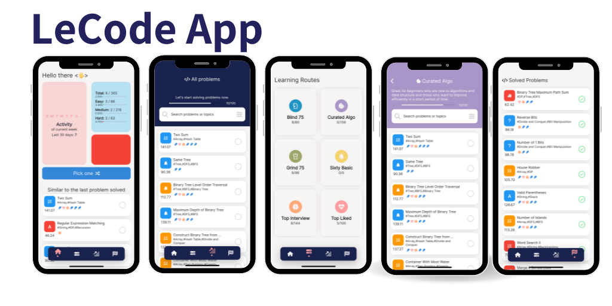

# LeCode_app

The goal of the application is to take control of the most popular exercises of LeetCode, the first version aims to show a basic version of different learning paths.

This release allowed me to explore using various packages I created to make it easier to build apps in Flutter.

## Version 1

# Version 2
Goal: 
- Web version
- Read information from leetcode